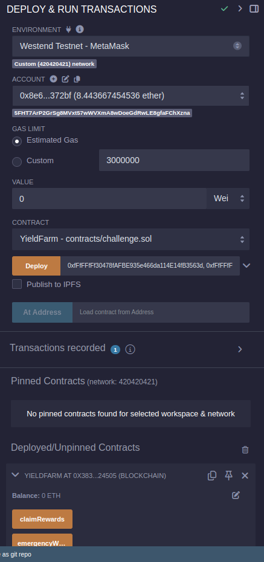

# 🌾 OpenHack Yield Farming Challenge 💰

The **OpenGuild Labs ** makes the repository to introduce OpenHack workshop participants to Solidity and help the participants to get familiar with the language. This challenge involves creating a smart yield-farming contract where users can stake LP tokens and earn rewards. You'll learn about DeFi mechanics, reward distribution, and staking mechanisms in Solidity and deploy on PolkaVM. 🚀

## Participant Registration

Add your information to the below list to officially participate in the workshop challenge (This is the first mission of the whole workshop)

| Emoji | Name            | Github Username                                       | Occupations              |
| ----- | --------------- | ----------------------------------------------------- | ------------------------ |
|   🎅  | Ippo            | [NTP-996](https://github.com/NTP-996)                 | DevRel                   |

## 💻 Local development environment setup

### 1. Install Volta (Node.js Version Manager)

#### Windows
1. Download the Windows installer from https://docs.volta.sh/guide/getting-started
2. Run the installer and follow the prompts
3. Open a new terminal to activate Volta

#### macOS/Linux
```bash
# Install Volta
curl https://get.volta.sh | bash

# Restart your terminal or run
source ~/.bashrc  # for bash
source ~/.zshrc   # for zsh
```

### 2. Install Node.js and npm using Volta
```bash
# Install Node.js LTS version
volta install node

# Verify installation
node --version
npm --version
```

## 🚀 Getting Started


```bash
git clone git@github.com:NTP-996/open-hack-yield-farm.git
cd open-hack-yield-farm
npm i
```

### 👉 Start working on the `TODO`

## ✅ You finished the challenge when you passed all the tests

```bash
npx hardhat compile
npx hardhat test
```


## 🚀 Installing MetaMask and Deploying Smart Contracts on Asset-Hub Westend

At the time writing this challenge, Hardhat haven't support deployment on Westend network, we need to use [remix](https://remix.polkadot.io/) for smart contract deployment

### 🦊 Installing and Setting Up MetaMask

1. 💿 Install Metahttps://remix.polkadot.io/Mask
   - Visit the [MetaMask website](https://metamask.io)
   - Click "Download" and add the extension to your browser
   - Create a new wallet by following the setup wizard
   - 🔐 Save your seed phrase securely and never share it with anyone

2. ⚙️ Configure Asset-Hub Westend Network
   - Click the network dropdown at the top of MetaMask
   - Select "Add Network" > "Add Network Manually"
   - Enter the following details:
     - 🌐 Network Name: Asset-Hub Westend Testnet
     - 🔗 RPC URL: https://westend-asset-hub-eth-rpc.polkadot.io
     - 🔢 Chain ID: 420420421
     - 💰 Currency Symbol: WND
     - 🔍 Block Explorer URL: https://assethub-westend.subscan.io

### 🪙 Getting Test Tokens

1. 💧 You'll need some WND tokens to deploy contracts
   - Visit the [Westend faucet](https://faucet.polkadot.io/westend?parachain=1000)
   - Request test tokens for your MetaMask address
   - ⏳ Wait for the tokens to appear in your wallet

## 💻 Using Remix and Deploying a Contract

🎯 Access Remix

   - Go to https://remix.polkadot.io
   - Simply copy/paste your yeild.sol contract

🔨 Compile the Contract

   - Select the "Solidity Compiler" tab
   - Choose compiler version (e.g., 0.8.0)
   - Click "Compile"

📤 Deploy the Contract

   - Go to the "Deploy & Run Transactions" tab
   - Set the environment to "Injected Provider - MetaMask"
   - Ensure your MetaMask is connected to Asset-Hub Westend
   - Click "Deploy"
   - Confirm



---

### 🙋‍♂️ How to claim the bounty?
 Complete the challenge on your fork repository <br/>
⭐ Star Open Guild repository <br/>
👥 Follow OpenGuild Lab Github <br/>
💬 Join OpenGuild Discord <br/>
📝 Submit the proof-of-work (your challenge repository) to OpenGuild Discord <br/>

---
# 🤝 How to contribute to the community?

To submit a proposal, ideas, or any questions, please submit them here: [OpenGuild Discussion 💭](https://github.com/orgs/openguild-labs/discussions)
View tickets and activities that you can contribute: [Community Activities 🎯](https://github.com/orgs/openguild-labs/discussions/categories/activities)

- **🌱 Help to grow the community:** Community growth is a collective effort. By actively engaging with and inviting fellow enthusiasts to join our community, you play a crucial role in expanding our network. Encourage discussions, share valuable insights, and foster a welcoming environment for newcomers.

- **🎓 Participate in workshops and events:** Be an active participant in our workshops and events. These sessions serve as valuable opportunities to learn, collaborate, and stay updated on the latest developments in the Polkadot ecosystem. Through participation, you not only enhance your knowledge but also contribute to the collaborative spirit of OpenGuild. Share your experiences, ask questions, and forge connections with like-minded individuals.

- **💡 Propose project ideas:** Your creativity and innovation are welcomed at OpenGuild. Propose project ideas that align with the goals of our community. Whether it's a new application, a tool, or a solution addressing a specific challenge in the Polkadot ecosystem, your ideas can spark exciting collaborations.

- **🛠️ Contribute to our developer tools:** Get involved in the ongoing development and improvement of tools that aid developers in their projects. Whether it's through code contributions, bug reports, or feature suggestions, your involvement in enhancing these tools strengthens the foundation for innovation within OpenGuild and the broader Polkadot community. **Contribute to our developer tools:** Get involved in the ongoing development and improvement of tools that aid developers in their projects. Whether it's through code contributions, bug reports, or feature suggestions, your involvement in enhancing these tools strengthens the foundation for innovation within OpenGuild and the broader Polkadot community.
